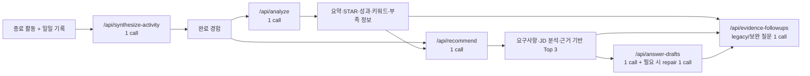

# CampusLog AI Model Benchmark

> 기준일: 2026-08-12 · 데이터 분류: 합성 테스트 데이터만 사용(실제 사용자 기록·개인정보 미사용) · 최종 Hybrid 모델 매핑 적용

발표·의사결정용 요약표는 [`AI_MODEL_DECISION_MATRIX.md`](./AI_MODEL_DECISION_MATRIX.md)를 참고한다. 이 문서는 전체 코드 분석과 benchmark 상세 결과를 보존한다.

## 1. 현재 AI 구조

현재 production AI route는 모두 OpenAI Responses API(`POST /v1/responses`)를 서버에서 직접 호출하며 `store: false`와 strict JSON schema를 사용한다. 모델 매핑은 server-only `aiModelConfig.ts`에서 한 곳으로 관리한다.

| Route | 기능 | 모델 | 응답 방식 | OpenAI timeout |
| --- | --- | --- | --- | ---: |
| `/api/synthesize-activity` | 종료된 날짜별 활동 기록을 완료 경험 초안으로 합성 | `gpt-5.6-luna` | strict JSON / 선택적 SSE | 50초 |
| `/api/analyze` | 경험 요약, 성과, 키워드, STAR, 부족 정보 질문 | `gpt-5.6-luna` | strict JSON / 선택적 SSE | 45초 |
| `/api/recommend` | 문항·면접·직무·JD 요구사항 분석, 근거 기반 Top 3 추천 | `gpt-4.1-mini` | strict JSON / 선택적 SSE | 60초 |
| `/api/answer-drafts` | 선택 경험의 자소서·면접·포트폴리오·JD 결과물 초안 | `gpt-5.6-luna` | strict JSON / NDJSON stream | 70초 |
| `/api/evidence-followups` | 분석/추천/초안의 부족 근거를 보완할 안전한 질문 | `gpt-5.6-luna` | strict JSON | 50초 |

`/api/analyze`, `/api/recommend`, `/api/synthesize-activity`, `/api/evidence-followups`는 OpenAI 응답을 다시 JSON parse·정규화한다. `/api/answer-drafts`는 분량을 벗어나면 동일 모델로 repair 요청을 한 번 더 보낼 수 있으므로, 한 사용자 행동은 보통 1회, 분량 보정 시 최대 2회다. 나머지 AI 기능은 사용자 행동당 1회다. API key는 server 환경 변수에서만 읽고 본 테스트·문서·로그에는 값을 기록하지 않았다.

temperature는 어느 route에도 설정하지 않아 API 기본 동작을 사용한다. Luna route에는 A/B와 같은 `reasoning: { effort: "none" }`을 명시한다. 공통 보호는 Supabase 세션 확인, runtime-local rate limit, 요청 크기/필드 검증, AbortController timeout, 오류 코드(502/504 포함)다. 재시도는 답변 초안의 분량 repair 외에는 자동 수행하지 않는다.

## 2. AI 기능별 호출 흐름

추천은 원본 경험 전부를 보내지 않고 클라이언트가 후보를 선별·압축한 context(최대 50개)를 전송한다. 이미지가 있으면 JPG/PNG/WebP 최대 3장을 같은 추천 API 호출의 vision input으로 포함한다. 이번 텍스트 benchmark는 이미지 OCR/vision과 answer draft는 범위에서 제외했으며, 모델 변경 전 별도 회귀 검증이 필요하다.

## 3. 비교 모델

실제 계정의 `GET /v1/models/{id}` 확인과 실제 Responses API 호출을 모두 통과한 정확한 model ID는 다음과 같다.

| 구분 | 실제 비교 ID | 선택 이유 |
| --- | --- | --- |
| Luna | `gpt-5.6-luna` | 사용자가 말한 Luna 계열의 현재 API 모델. 비용 민감·고처리량용 모델 |
| 현재 production | `gpt-4.1-mini` | 코드의 모든 production route가 사용하는 GPT-4.1 계열 모델 |

`gpt-4.1`(full)은 현재 사용 모델이 아니다. 따라서 현 모델 유지/전환 판단에는 `gpt-4.1-mini`가 공정한 기준이다. Luna는 reasoning 기본값이 GPT-4.1 mini와 다르므로, 비교 호출에서 `reasoning: { effort: "none" }`으로 고정했다. 두 모델 모두 Responses API와 structured outputs를 지원한다. 공식 가격은 Luna input/output $0.20/$1.20, GPT-4.1 mini $0.40/$1.60 per 1M tokens다. [GPT-5.6 Luna 모델 문서](https://developers.openai.com/api/docs/models/gpt-5.6-luna), [GPT-4.1 mini 모델 문서](https://developers.openai.com/api/docs/models/gpt-4.1-mini), [OpenAI 모델 카탈로그](https://developers.openai.com/api/docs/models)

## 4. 테스트 환경

- 실행 위치: `web/`, Node.js 23.11.0, 2026-08-12 KST
- 실행: `env -u OPENAI_API_KEY npm run dev`가 필요한 프로젝트 환경 규칙을 확인했다. benchmark는 dev route를 통과하지 않고 `.env.local`의 키를 메모리에서만 읽어 OpenAI API에 직접 요청하므로, 인증·DB·production 데이터에는 영향을 주지 않는다.
- 요청 형식: production route에서 런타임으로 직접 추출한 `createPrompt` / `createRecommendationPrompt`, system prompt, strict JSON schema, `max_output_tokens`(분석 1600, 추천 4200), `store:false`, route와 동일한 timeout.
- 검증: API model availability, HTTP 오류/timeout, JSON parse, schema field/타입, 입력 경험 ID·rank, 필수 사실 언급, 금지 사실 탐지, Top-1 기대 경험, usage, latency를 기록했다.
- 반복: 핵심 분석 5종은 양 모델 1회씩 정확 route prompt로 실행했고, 대표 프로젝트 분석은 추가 반복을 수행했다. 추천은 자소서·면접·직무·JD 4종과 직무 추천 재실행을 포함했다. 답변 초안은 자소서 500자/1000자, 면접 60초, JD 전략 4종을 양 모델에 2회씩 실행하고, 자소서 분량 repair까지 포함했다. 기존 분석·추천 호출과 합쳐 완료 API 호출은 37회 이상이며, 답변 초안 추가 benchmark 자체는 16개 논리 비교(초기 API 16회 + repair 8회, 총 24 API 요청)다.
- 결과 보관: 합성 모델 출력과 usage가 든 원시 결과는 `.gitignore` 대상인 `/private/tmp`에 권한 0600으로만 보관했다. repository에는 benchmark script와 집계 문서만 둔다.

## 5. 테스트 데이터

테스트 데이터는 [`web/scripts/ai-model-benchmark.mjs`](../web/scripts/ai-model-benchmark.mjs) 안의 가상 경험 5개다.

| 영역 | 케이스 | 확인 목표 |
| --- | --- | --- |
| 경험 분석 | CampusLog 웹 서비스 프로젝트 | 구현·테스트 근거를 요약/STAR에 보존 |
| 경험 분석 | 청년 정책 홍보단 | 대외활동 카드뉴스 4건을 과장 없이 정리 |
| 경험 분석 | 도서관 학습 봉사 | 정보 부족 상태를 빈칸/보완 질문으로 처리 |
| 경험 분석 | 축제 부스 팀장 | 5명 협업·우선순위 조정과 없는 방문자/매출 구분 |
| 경험 분석 | 예약 API 개선 | 중복 요청·중복 예약·검증 로직의 기술 맥락 보존 |
| 경험 추천 | 자소서 협업 문항 | 축제 팀장을 1순위로 추천 |
| 경험 추천 | 면접 문제 해결 질문 | 예약 API 개선을 1순위로 추천 |
| 경험 추천 | 웹 서비스 직무 질문 | CampusLog 프로젝트를 1순위로 추천 |
| 경험 추천 | 긴 백엔드 JD | 예약 API 개선을 1순위로 추천하고 Spring/RDBMS 근거 부재를 분리 |

## 6. 품질 비교

정답은 사람이 작성한 기대 Top-1과 원본에 있는 핵심 사실이다. 품질 점수는 범용 벤치마크 점수가 아니라 CampusLog의 핵심인 사실성·근거 연결·Top-1 선택을 우선했다.

| 항목 | Luna | GPT-4.1 mini | 우세 |
| --- | ---: | ---: | --- |
| 분석 핵심 사실 언급 | 5/5 | 5/5 | 동률 |
| 분석 JSON/필수 field | 5/5 | 5/5 | 동률 |
| 추천 Top-1 기대 일치 | 4/5 | 6/6 | GPT-4.1 mini |
| JD Top-1·부족 기술 분리 | 1/1 | 1/1 | 동률 |
| 답변 초안 핵심 근거 언급 | 11/12 | 11/12 | 동률 |
| 답변 초안 최종 분량 범위 | 5/8 | 4/8 | Luna |
| 없는 수치/기술을 사실처럼 단정 | 관찰되지 않음* | 관찰되지 않음* | 동률 |
| 문장 밀도 | 더 상세하고 긴 근거 | 더 짧고 직접적 | 용도별 |

\* 자동 키워드 탐지는 `매출`, `사용자 수`, `Spring/RDBMS 경험` 같은 금지 문구의 단순 문자열을 잡을 수 있어, "기록에 없어 쓰면 안 된다"는 caution/missingEvidence 문장은 수동 검토했다. 두 모델은 핵심 JD에서 Spring·RDBMS를 보유했다고 단정하지 않고 부족 근거로 분리했다.

수동 검토에서는 Luna가 STAR와 추천 근거를 더 풍부하게 만들었고, GPT-4.1 mini는 더 간결했다. 다만 CampusLog의 최우선은 단순 요약이 아니라 다수 경험에서 질문에 맞는 경험을 고르는 정확도다. 작은 표본이지만 직무 추천 재실행까지 포함한 Top-1 결과가 GPT-4.1 mini 쪽으로 일관되었다. 따라서 quality 기준 단독으로 Luna 전체 전환을 정당화할 차이는 확인되지 않았다.

답변 초안은 양 모델 모두 strict JSON 초기 응답과 repair 응답이 성공했고, 합성 평가의 핵심 근거 언급률은 동률이었다. GPT-4.1 mini가 더 좋은 한국어 문장이나 hallucination 억제를 보였다는 직접 근거는 이번 표본에서 확인하지 못했다. 반면 긴 자기소개서 분량 보정은 두 모델 모두 일부 범위를 벗어났고, 이 benchmark의 자동 품질 지표만으로 최종 문장 자연스러움까지 결론 내릴 수 없다.

## 7. Structured Output 안정성

분석 route schema는 두 모델 모두 5/5 성공했다. API 오류, timeout, JSON parse 오류, 필수 field 누락은 없었다.

추천에서는 중요한 기존 계약 문제를 발견했다. production prompt는 비-JD일 때 `jdAnalysis`의 문자열을 빈 문자열, 배열을 빈 배열로 요구하지만, strict schema의 `jdAnalysis.finalVerdict` enum은 빈 문자열을 허용하지 않는다. 따라서 비-JD output은 어떤 모델도 prompt와 schema를 동시에 만족할 수 없다. 실제 route는 `purpose !== "jd"`에서 이를 정규화 후 버리므로 화면/저장 결과는 정상이나, 모델은 의미 없는 값 하나를 만들고 불필요한 token을 낸다.

| 항목 | Luna | GPT-4.1 mini | 해석 |
| --- | ---: | ---: | --- |
| 분석 strict schema 성공 | 5/5 | 5/5 | 안정적 |
| JD 추천 strict schema 성공 | 1/1 | 1/1 | 안정적 |
| 비-JD strict schema 성공 | 0/4 | 0/5 | 모델 문제가 아닌 schema/prompt 충돌 |
| route 후처리 기준의 Top-1 usable 결과 | 4/4 | 5/5 | 둘 다 usable, GPT가 더 정확 |
| API error/timeout | 0 | 0 | 이번 표본에서 없음 |
| 답변 초안 initial/repair schema 성공 | 8/8 · 4/4 | 8/8 · 4/4 | 동률 |
| 답변 초안 final 분량 범위 | 5/8 | 4/8 | Luna, 단 표본 작음 |

## 8. Latency 비교

아래는 동일 실행 환경에서 응답 전체 수신까지의 wall-clock latency다. 네트워크와 API 부하에 따라 달라질 수 있으나, 모든 짝 비교에서 Luna가 같거나 더 빨랐다.

| 기능 | Luna 평균 | Luna 범위 | GPT-4.1 mini 평균 | GPT-4.1 mini 범위 | 우세 |
| --- | ---: | ---: | ---: | ---: | --- |
| 경험 분석 | 4.95초 | 3.93–6.07초 | 7.00초 | 5.53–10.90초 | Luna |
| 경험 추천/JD | 9.85초 | 7.18–16.48초 | 14.58초 | 11.02–22.62초 | Luna |
| 답변 초안(분량 repair 포함) | 8.09초 | 4.86–11.80초 | 10.93초 | 4.63–14.84초 | Luna |
| 전체 호출 | 7.40초 | — | 11.13초 | — | Luna |

약 2~5초 차이는 CampusLog의 긴 프롬프트 추천 화면에서 사용자가 체감할 수 있다. 하지만 현재 서비스는 background task UX를 제공하므로, Top-1 추천 정확도보다 우선할 정도의 차이는 아니다.

## 9. Token / Cost 비교

가격 계산은 실제 response `usage`와 공식 on-demand token 단가만 적용했다. cached input, Batch API, 이미지 token, reasoning token, 세금은 포함하지 않았다.

| 기능 | Luna 평균 input / output | GPT-4.1 mini 평균 input / output | Luna 평균 요청 비용 | GPT-4.1 mini 평균 요청 비용 | 우세 |
| --- | ---: | ---: | ---: | ---: | --- |
| 경험 분석 | 2,309 / 598 | 2,311 / 465 | $0.00118 | $0.00167 | Luna |
| 경험 추천/JD | 5,353 / 1,291 | 5,354 / 912 | $0.00262 | $0.00360 | Luna |
| 답변 초안(초기+repair 합산) | 4,503 / 1,009 | 4,443 / 725 | $0.00211 | $0.00294 | Luna |
| 전체 표본 평균 | 3,831 / 944 | 3,971 / 709 | $0.00190 | $0.00272 | Luna |

Luna는 더 긴 JSON 설명을 출력했지만 input 단가가 절반, output 단가가 25% 낮아 전체 비용은 약 30% 낮았다.

| AI 요청 수 (표본 평균) | Luna | GPT-4.1 mini | 차이 |
| ---: | ---: | ---: | ---: |
| 100 | 약 $0.19 | 약 $0.27 | 약 $0.08 절감 |
| 1,000 | 약 $1.90 | 약 $2.72 | 약 $0.82 절감 |
| 10,000 | 약 $19.00 | 약 $27.22 | 약 $8.22 절감 |

답변 초안만 같은 사용량으로 환산하면 다음과 같다(분량 repair가 포함된 이번 표본 평균).

| 답변 초안 요청 수 | Luna | GPT-4.1 mini | 차이 |
| ---: | ---: | ---: | ---: |
| 100 | 약 $0.21 | 약 $0.29 | 약 $0.08 |
| 1,000 | 약 $2.11 | 약 $2.94 | 약 $0.82 |
| 10,000 | 약 $21.11 | 약 $29.36 | 약 $8.25 |

이는 한 요청을 분석/추천 표본과 같은 비율로 가정한 추정치다. 답변 초안, image input, answer-draft repair, 대형 JD·경험 context가 많은 실제 운영 믹스에는 직접 적용하면 안 된다.

이번 답변 초안 A/B 자체는 16개 논리 비교와 총 24회 API 요청(두 모델 각각 초기 8회 + repair 4회)에 약 `$0.0404`가 사용됐다. 즉 이 정도의 재현 가능한 합성 benchmark는 프로젝트 API 비용 관점에서 수 센트 수준이다. 사람 평가용 케이스를 늘려도 100회 호출은 대체로 `$1 미만`으로 예상되지만, 실제 비용은 입력 context·출력 길이·repair 비율에 따라 usage로 다시 계산해야 한다.

## 10. 기능별 비교 결과

| 기능 | 판단 | 근거 |
| --- | --- | --- |
| 활동 종료 경험 합성 | Luna 적용 후보 | 이번 A/B 범위 밖. 장문 입력·날짜 순서·사실성 회귀 테스트를 적용 전에 수행 |
| 활동 경험 분석 | Luna 후보 가능 | 사실성/JSON이 동률이고 약 2초 빠르며 약 29% 저렴 |
| 단순 요약·키워드·보완 질문 | Luna 후보 가능 | 구조화된 짧은 사실 기반 결과에 충분한 품질 확인 |
| 자기소개서·면접·직무 경험 추천 | GPT-4.1 mini 유지 | 더 높은 Top-1 일치, 짧고 직접적인 근거 |
| 긴 JD 분석 | GPT-4.1 mini 유지 | 두 모델 모두 결과는 양호했으나 CampusLog의 가장 높은 위험 기능이며 GPT가 더 절제된 output과 1순위 안정성을 보임 |
| 답변 초안 | Luna | GPT-4.1 mini 우세 근거가 없고, 예시 비교에서 Luna가 더 구체적이며 약 28% 저렴 |

## 11. 발견된 문제

1. **추천 비-JD schema/prompt 모순 (major)**: `recommendationV2ResponseSchema`의 `jdAnalysis.finalVerdict`가 `""`을 허용하지 않지만 prompt는 비-JD에서 빈 문자열을 요구한다. 실제 route는 결과를 버려 기능 장애는 없지만 strict structured output의 목적을 약화하고 token·출력 변동성을 만든다.
2. **추천 결과 semantic validation의 여지**: route는 경험 ID, 중복, rank를 정리하지만 `matchedEvidence`가 원본 문장을 실제로 인용했는지까지 강제하지 않는다. 모델 품질보다 사실성 방어를 높이려면 evidence option 방식의 서버 검증을 고려할 수 있다.
3. **metrics에 token/비용 미기록**: `aiRequestMetrics.ts`는 latency와 retry만 콘솔로 기록한다. OpenAI usage 기반 input/output token과 예상 비용을 구조화 로그로 남기면 이후 실제 운영 data로 모델 선택을 재검증할 수 있다.
4. **현재 runtime-local rate limit**: 다중 Vercel 인스턴스에서는 전역 제한이 아니다. 비용 통제에는 durable rate limit/spend alert가 여전히 필요하다.

## 12. 최종 추천

**C. 기능별 Hybrid 사용**을 최종 추천안으로 결정한다.

- 경험 추천 → `gpt-4.1-mini`: 현재 표본에서 Top-1 기대 일치가 더 높았고 CampusLog의 핵심 가치와 직접 연결된다.
- 경험 분석 → `gpt-5.6-luna`: 사실성·JSON 안정성이 동률이며 더 빠르고 저렴했다.
- 답변 초안 → `gpt-5.6-luna`: 이번 A/B에서 GPT 우세가 없었고, 출력 예시의 구체성·근거 연결은 Luna가 더 나았으며 평균 비용과 latency도 낮았다.
- 단순 보완 질문 → `gpt-5.6-luna`: 분석과 유사한 사실 기반 구조화 경로로 분류한다. 적용 전 중복 질문·유도성 회귀 테스트는 필요하다.
- 활동 종료 합성 → `gpt-5.6-luna`: 장문 기록 정리·요약 경로로 분류한다. 적용 전 긴 입력·날짜 순서 보존 회귀 테스트는 필요하다.

이 Hybrid는 “GPT-4.1 mini가 모든 생성 기능에서 더 좋다”는 뜻이 아니다. 현재 직접 확인된 GPT 우세는 경험 추천의 Top-1 선택이며, 나머지 기능은 Luna의 품질·속도·비용 조합을 우선한다. 보완 질문과 활동 합성은 production 반영 전 별도 회귀 테스트를 통과시키는 조건부 결정이다.

## 13. 추천 모델 구성

production 변경은 이번 작업에서 하지 않는다. 적용 승인 후에는 `/api/recommend`만 `gpt-4.1-mini`, 나머지 AI route는 `gpt-5.6-luna`를 선택하는 server-only model config를 두고, 결과 metadata에 model id와 benchmark version을 저장하는 Hybrid를 권장한다. 보완 질문·활동 합성은 적용 직전 회귀 테스트를 통과시키고, 실패 시 Luna 적용을 보류한다.

다음 단계에서는 보완 질문과 활동 합성의 회귀 테스트를 실행한다. 현재 목표 매핑은 `/api/recommend`만 `gpt-4.1-mini`, `/api/analyze`, `/api/answer-drafts`, `/api/evidence-followups`, `/api/synthesize-activity`는 `gpt-5.6-luna`다.

## 14. 코드 변경이 필요한 부분

이번 작업에서는 production model을 변경하지 않았다. 적용 승인 후 필요한 변경은 다음과 같다.

1. [`web/src/app/api/recommend/route.ts`](../web/src/app/api/recommend/route.ts): 비-JD 전용 response schema를 분리하거나 `jdAnalysis.finalVerdict`에 `""`을 허용하고, 그에 맞춰 prompt/normalizer 테스트를 수정한다.
2. [`web/src/lib/aiRequestMetrics.ts`](../web/src/lib/aiRequestMetrics.ts): API response usage, input/output tokens, estimated cost, schema/repair 결과를 privacy-safe structured metric으로 추가한다.
3. 모델 전환이 승인된 경우에만 각 route의 `*_MODEL` 상수(또는 단일 server-only model config)를 바꾼다. 현재는 다섯 route에 상수가 분산되어 있어 model config 모듈로 통합하는 작은 별도 PR을 권장한다.
4. [`web/scripts/ai-model-benchmark.mjs`](../web/scripts/ai-model-benchmark.mjs): 모델 config와 함께 CI가 아닌 수동 release gate로 유지한다. `.env.local`이 필요하고 실제 비용이 발생하므로 일반 test suite에는 넣지 않는다.

## 15. 향후 최적화 아이디어

- 분석·추천 결과의 anonymized 운영 표본과 사람 평가 rubric(사실성, Top-1, 근거 인용, 한국어 자연스러움)을 월별 20~30건씩 blind review한다.
- 추천 schema의 비-JD `jdAnalysis`를 nullable/분리 schema로 바꾸어 불필요한 output token과 변동성을 제거한다.
- 추천 `matchedEvidence`를 선택 가능한 원본 evidence ID 또는 정확 복사 목록으로 제한해 hallucination 방어를 강화한다.
- image JD 3장, 최대 압축 후보 50개, 1,000자 answer draft와 repair을 별도 테스트 축으로 추가한다.
- model alias 대신 검증한 snapshot을 canary 기간에 사용해 재현성을 높이고, 업데이트 때 이 benchmark를 다시 실행한다.
