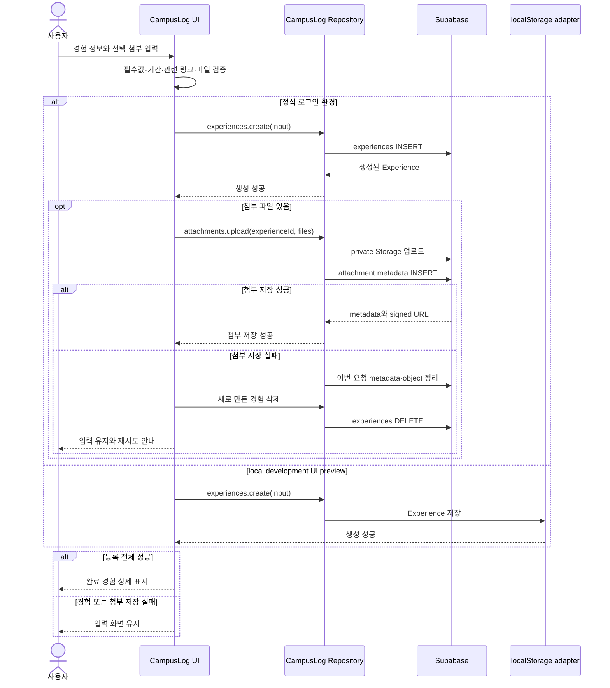
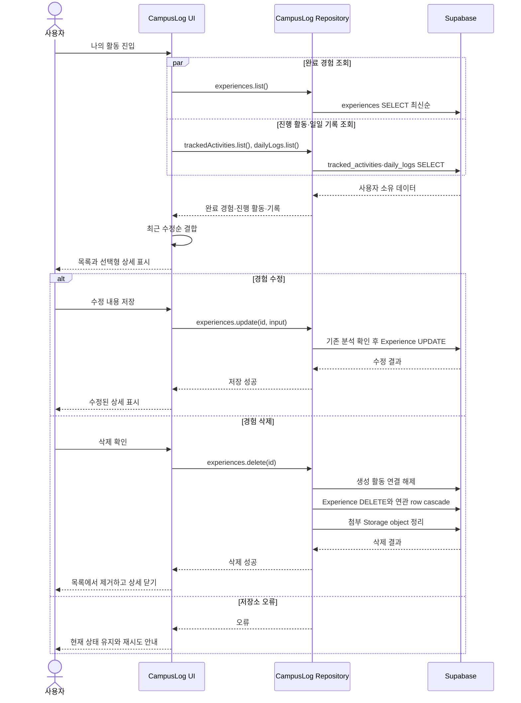
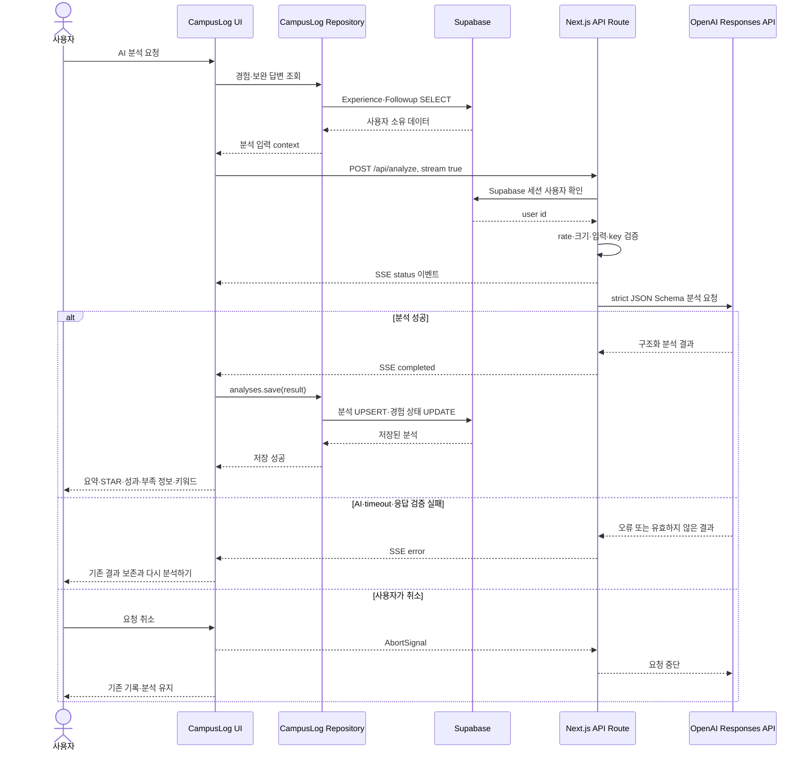
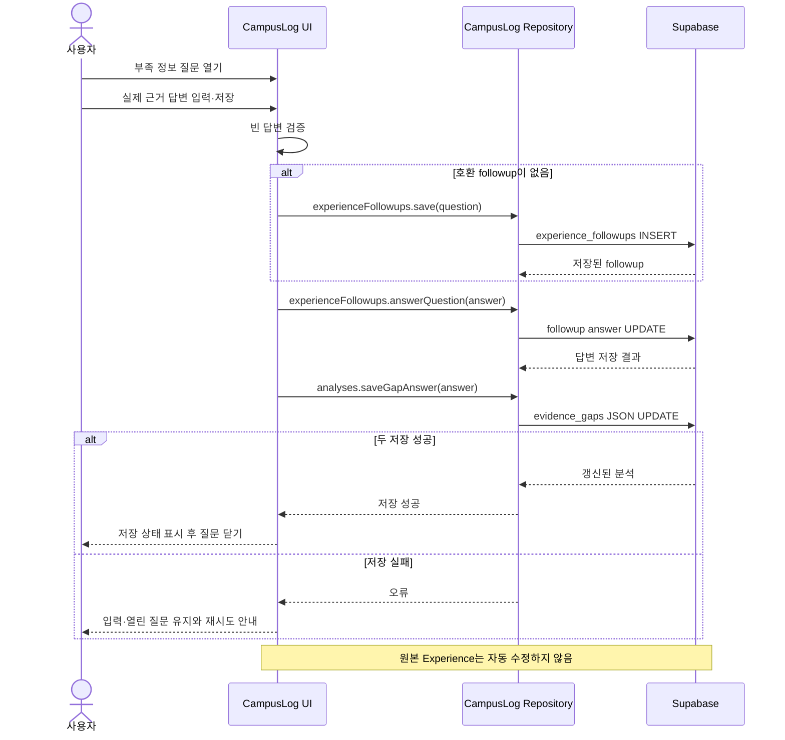
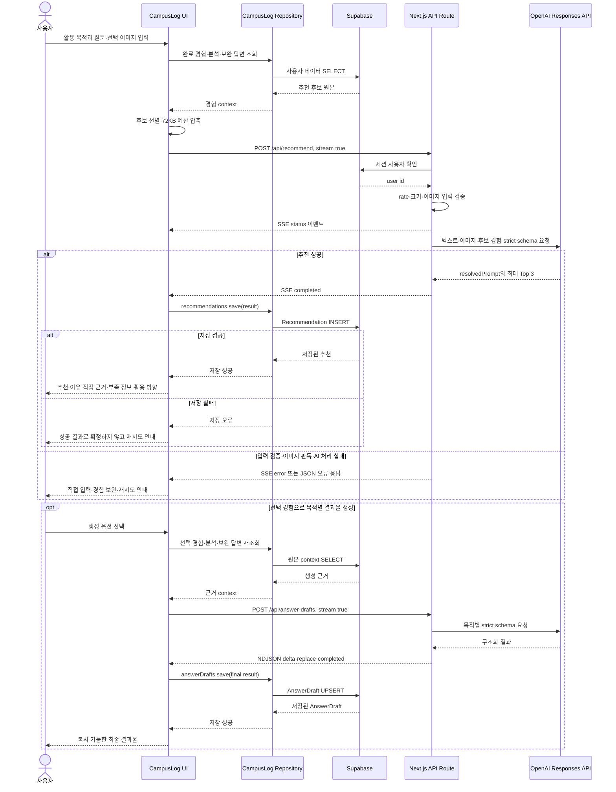
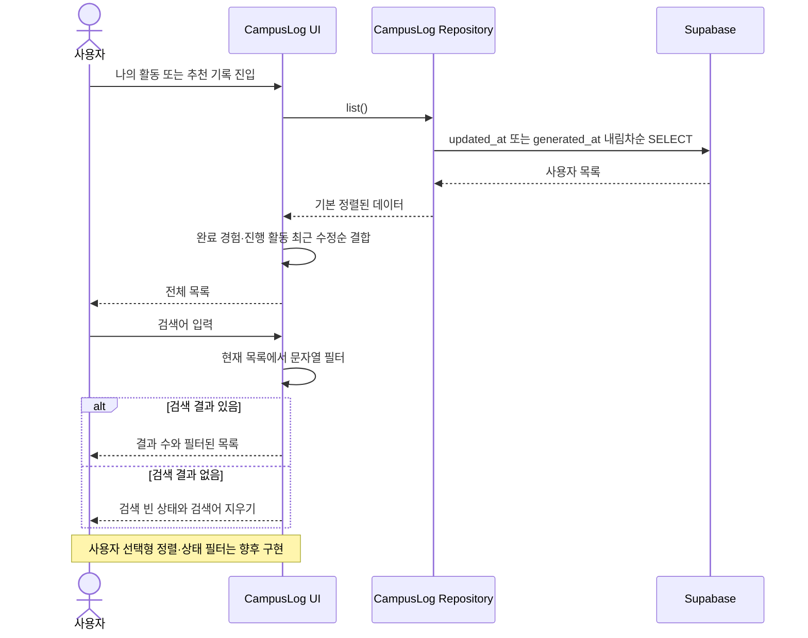
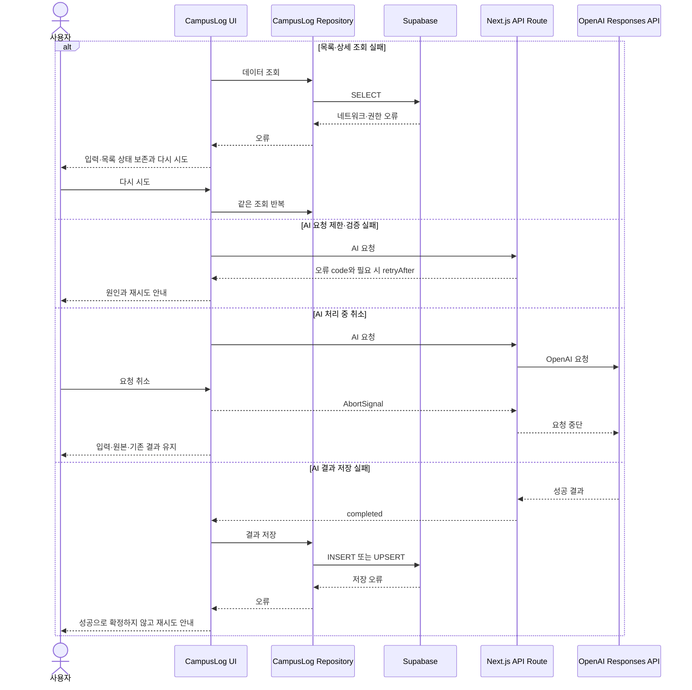
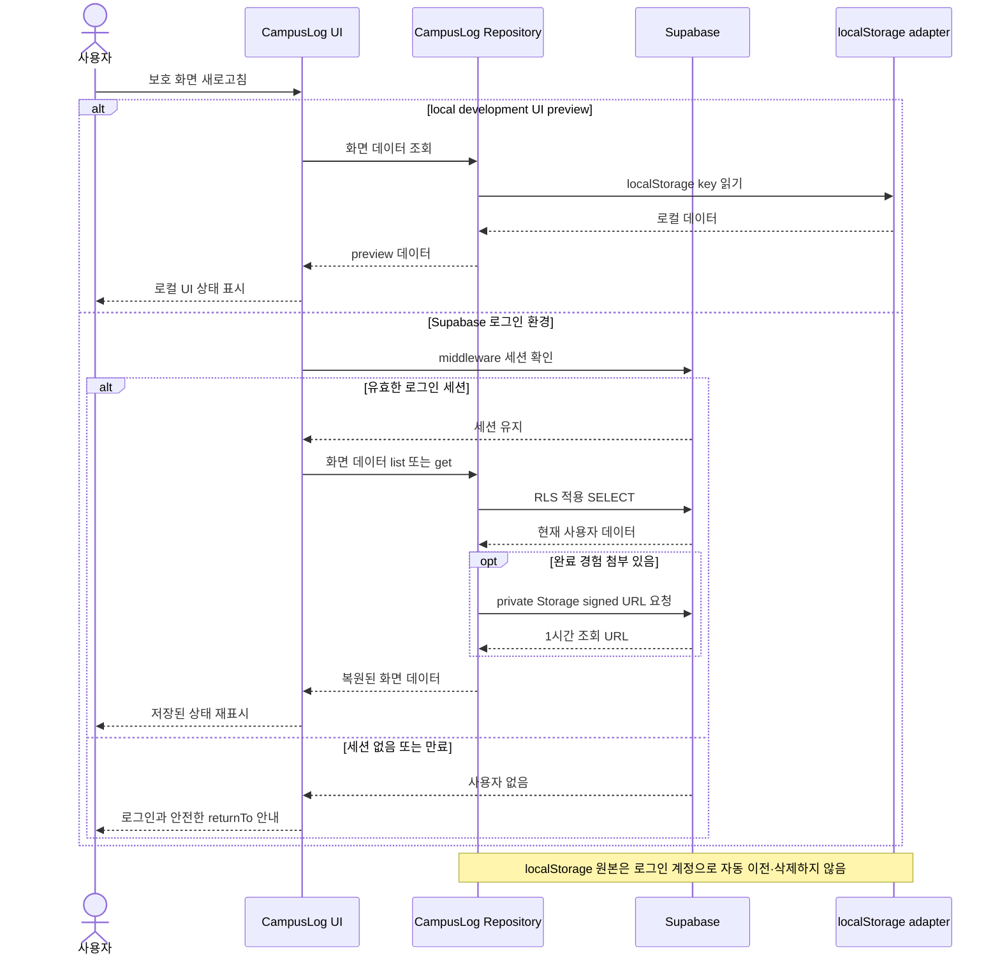

# CampusLog 1차 MVP 시퀀스 플로우

> 이 문서는 UNIKER 1기 중간 데모 제출을 위해 현재 저장소의 문서와 실제 구현 상태를 기준으로 정리한 1차 MVP 스냅샷입니다.

## 1. 문서 개요

### 작성 목적

사용자의 조작이 CampusLog 화면, repository, Supabase, Next.js API Route와 OpenAI 처리로 어떻게 이어지고 결과가 어디에 저장되는지 실제 코드 기준으로 설명한다.

### 참여 주체

| 참여 주체 | 역할 | 실제 구현 |
| --- | --- | --- |
| 사용자 | 기록 작성, 분석·추천 실행, 결과 확인, 오류 재시도 | 브라우저에서 CampusLog 사용 |
| CampusLog UI | 폼 검증, 화면 상태, 요청 취소, 결과 표시 | Next.js App Router의 client/server component, `web/src/app/**`, `web/src/components/**` |
| CampusLog Repository | UI와 저장 기술 사이의 비동기 CRUD 계약 | `web/src/lib/repositories/campuslogRepository.ts` |
| Supabase | 인증 세션, Postgres·RLS, private Storage와 signed URL | `web/src/lib/supabase/**`, `supabase/migrations/**` |
| Next.js API Route | AI 요청 인증·상한·rate guard·timeout·schema 검증 | `web/src/app/api/**/route.ts` |
| OpenAI Responses API | 경험 분석, 완료 경험 합성, 추천, 목적별 결과물 생성 | 서버 환경의 `OPENAI_API_KEY`, 현재 모델 `gpt-4.1-mini` |
| localStorage adapter | 인증 없는 local development UI preview의 데이터 저장 | `web/src/lib/storage.ts`; 정식 로그인 계정의 기본 저장소가 아님 |

### 현재 MVP 아키텍처 요약

```text
사용자
  ↓
Next.js App Router UI
  ├─ CampusLog Repository → Supabase Auth / Postgres / private Storage
  └─ Next.js AI API Route → OpenAI Responses API
                              ↓
                    UI가 결과를 받은 뒤 Repository로 저장
```

핵심 구조상 일반 CRUD는 별도의 CampusLog REST 서버를 거치지 않는다. 브라우저의 Supabase client가 `CampusLog Repository`를 통해 Postgres·Storage에 접근하고 RLS가 로그인 사용자의 행을 제한한다. AI 요청만 Next.js Route Handler를 거치며, API Route는 AI 결과를 DB에 직접 저장하지 않는다. 화면이 성공 결과를 받은 뒤 repository로 저장하고, 저장까지 성공해야 결과 화면을 확정한다.

인증 없는 local development UI preview에서는 repository가 localStorage adapter를 사용한다. production 보호 화면은 Supabase 설정과 로그인 세션을 요구하며, localStorage 데이터를 로그인 계정으로 자동 이전하거나 자동 삭제하지 않는다.

현재 production은 Vercel에 배포되어 실제 Supabase project의 최신 migration, Postgres·RLS·private Storage, OAuth callback과 OpenAI 호출을 사용한다. 첨부·보완 답변·추천 이미지 출처의 저장과 새로고침 후 재조회, SSE·NDJSON 응답도 실제 서비스에서 동작하는 상태다.

## 2. 전체 사용자 흐름

현재 구현의 대표 흐름은 다음과 같다.

```text
공개 진입·로그인
→ 오늘의 기록에서 진행 활동 관리 또는 과거 경험 직접 등록
→ 나의 활동 목록·상세 확인
→ AI 경험 분석
→ 부족 정보 보완
→ 면접 / 자기소개서 / JD 분석 / 기타 목적과 질문 입력
→ 적합한 경험 최대 Top 3 추천
→ 추천 이유·직접 근거·부족 정보·활용 방향 확인
→ 필요 시 목적별 결과물 생성
→ 추천 기록에서 재조회
```

진행 활동을 사용하는 경우 앞부분은 다음 흐름으로 확장된다.

```text
오늘의 기록
→ 활동 추가
→ 오늘 또는 과거 날짜에 한 일 기록
→ 활동 종료
→ AI 완료 경험 초안
→ 사용자 검토·수정
→ 나의 활동에 완료 경험 저장
```

## 3. 경험 등록 시퀀스

### 단계별 설명

1. 사용자가 `/experiences/new`에서 제목, 기간, 역할, 내용, 성과와 관련 링크를 입력한다.
2. `ExperienceForm`은 필수값, 기간 형식, URL 형식, 빈 URL의 설명과 중복 URL을 검사한다.
3. UI는 `CampusLog Repository.experiences.create()`를 호출한다.
4. 정식 로그인 환경에서는 Supabase `experiences` table에 행을 만들고 RLS가 현재 사용자 소유만 허용한다.
5. 첨부 파일이 있으면 경험 생성 뒤 private Storage에 object를 올리고 `experience_attachments` metadata를 저장한다.
6. 새 경험의 첨부 업로드가 실패하면 UI는 이번에 만든 경험을 삭제해 부분 저장을 정리하고 입력 화면에 오류를 표시한다.
7. 저장 성공 후 `/experiences/[id]`로 이동한다.
8. local development UI preview에서는 경험 본문만 localStorage에 저장하며 파일 본문 첨부는 지원하지 않는다.



관련 코드: `ExperienceForm.tsx`, `NewExperienceClient.tsx`, `experienceAttachments.ts`, `campuslogRepository.ts`.

## 4. 경험 조회·수정·삭제 시퀀스

### 단계별 설명

1. `/experiences` 진입 시 UI가 완료 경험, 진행 활동과 일일 기록을 repository에서 읽고 완료 경험별 저장 분석도 조회한다.
2. UI는 완료 경험과 진행 활동을 `updatedAt` 내림차순으로 합쳐 표시한다.
3. 사용자가 항목을 선택하면 목록을 유지한 채 인라인 상세를 표시한다. 완료 경험은 독립 상세 `/experiences/[id]`로도 이동할 수 있다.
4. 수정 화면은 기존 경험과 첨부 수를 읽고, 본문 변경이 있을 때만 `experiences.update()`를 실행한다.
5. 기존 분석이 있는 경험 본문을 수정하면 `analysisStatus`를 `needs_reanalysis`로 바꾼다. 첨부만 추가한 수정은 원본과 분석 상태를 변경하지 않는다.
6. 삭제는 사용자 확인 뒤 실행한다. repository는 생성 원본 활동과의 연결을 해제하고 경험을 삭제하며 DB cascade가 분석·추천·보완·결과물 metadata를 정리한다. 첨부 Storage object도 삭제를 시도한다.
7. 조회·수정·삭제 실패 시 현재 목록·상세 또는 입력을 가능한 한 유지하고 오류를 표시한다.



관련 코드: `ExperienceDashboard.tsx`, `ExperienceDetailClient.tsx`, `EditExperienceClient.tsx`, `DashboardExperienceDetail.tsx`, `campuslogRepository.ts`.

## 5. AI 경험 분석 시퀀스

### 단계별 설명

1. 사용자가 완료 경험 상세 또는 분석 화면에서 `AI 분석 요청`이나 `다시 분석하기`를 선택한다.
2. UI는 repository에서 최신 경험과 해당 경험의 보완 답변을 읽는다.
3. UI는 `stream: true`로 `/api/analyze`에 경험과 보완 답변을 보낸다.
4. API Route는 Supabase 세션, 사용자별 runtime-local rate guard, 요청 크기와 입력 충분성, `OPENAI_API_KEY`를 순서대로 검사한다.
5. Route는 `gpt-4.1-mini` Responses API를 한 번 호출하고 strict JSON Schema로 요약, STAR, 주요 성과, 부족 정보와 키워드를 받는다.
6. 대기 중 서버의 `status` SSE 이벤트가 전체 화면 `AIProcessingPanel`에 표시된다.
7. 성공 결과를 받은 UI가 `repository.analyses.save()`를 호출해 분석을 저장하고 경험의 분석 상태를 `analyzed`로 바꾼다.
8. OpenAI 또는 저장 실패 시 기존 경험과 마지막 유효 분석은 유지된다. 사용자는 같은 조건으로 다시 실행할 수 있다.



관련 코드: `ExperienceAnalysisClient.tsx`, `ExperienceDashboard.tsx`, `analysisApi.ts`, `/api/analyze`, `AIProcessingPanel.tsx`.

## 6. 부족 정보 보완 시퀀스

### 단계별 설명

1. 분석 결과의 `부족 정보`는 질문별 접힌 `MorphSurface`로 표시되며 한 번에 하나만 열린다.
2. 사용자가 답변을 입력하면 UI가 빈 답변을 먼저 차단한다.
3. 해당 질문의 호환 `ExperienceFollowup`이 없으면 repository에 먼저 만든다.
4. repository가 followup 답변을 저장한 뒤 분석의 `evidenceGaps.answer`도 갱신한다.
5. 성공 뒤에만 질문 표면을 닫고 저장 상태를 표시한다. 실패하면 입력과 열린 상태를 유지한다.
6. 이 과정은 별도 OpenAI 호출을 하지 않으며 원본 `Experience`도 수정하지 않는다.
7. 새 추천과 목적별 결과물 생성은 repository에서 이 답변을 읽어 context에 병합한다. 요약·STAR를 갱신하려면 사용자가 다시 분석해야 한다.



현재 followup과 분석 갱신은 두 번의 순차 저장이며 단일 DB transaction은 아니다. 첫 저장 뒤 두 번째 저장이 실패할 가능성은 향후 transaction 또는 RPC로 보강할 대상이다.

관련 코드: `AnalysisGapAnswerList.tsx`, `analysisGapAnswers.ts`, `experienceFollowupResult.ts`, `campuslogRepository.ts`.

## 7. 질문 기반 경험 추천 시퀀스

### 단계별 설명

1. `/recommend`는 repository에서 완료 경험과 각 경험의 분석·보완 답변을 읽는다.
2. 사용자는 `면접 / 자기소개서 / JD 분석 / 기타` 목적과 텍스트 질문을 입력한다. 텍스트 대신 또는 함께 JPG·PNG·WebP 이미지를 최대 3장 첨부할 수 있다.
3. UI는 목적·질문의 단서, 최신 수정일, 분석·보완 답변 여부를 기준으로 후보를 정렬하고 72KB 예산 안에서 context를 압축한다.
4. `/api/recommend`는 세션, rate, 본문·필드와 이미지 형식을 검증하고 `gpt-4.1-mini`에 텍스트·이미지·후보 경험을 한 번에 보낸다.
5. AI는 읽은 질문을 `resolvedPrompt`로 정리하고 최대 3개의 경험, 직접 근거, 부족 근거, 과장 위험과 활용 각도를 반환한다. 적합한 경험이 부족하면 3개를 억지로 채우지 않는다.
6. UI는 API 성공 결과를 먼저 화면에 확정하지 않고 `repository.recommendations.save()`로 저장한다. 저장 성공 후에만 추천 결과를 표시한다.
7. 사용자가 목적별 결과물을 생성하면 선택 경험의 원본·분석·보완 답변을 다시 읽고 `/api/answer-drafts`를 호출한다. NDJSON으로 본문을 점진 표시하고 최종 정규화 결과만 별도 `answer_drafts` 저장소에 저장한다.



관련 코드: `RecommendationForm.tsx`, `RecommendationImagePicker.tsx`, `recommendationInputCompaction.ts`, `/api/recommend`, `RecommendationResult.tsx`, `/api/answer-drafts`.

## 8. 정렬·필터 시퀀스

### 단계별 설명

1. repository의 완료 경험과 진행 활동 목록 조회는 `updated_at` 내림차순을 기본으로 한다.
2. `나의 활동` UI는 두 목록을 합친 뒤 다시 `updatedAt` 내림차순으로 정렬한다.
3. 사용자가 검색어를 입력하면 서버 재요청 없이 현재 메모리의 제목을 NFKC 정규화·소문자화해 필터링한다.
4. 추천 기록 검색은 활용 목적, 질문, 추천 경험명과 추출 요구사항을 같은 방식으로 검색한다.
5. 검색 결과가 없으면 일반 데이터 없음과 다른 `검색 결과가 없습니다` 상태와 검색어 지우기 동작을 보여준다.
6. `SortSelect`와 `FilterDropdown`, 관련 타입은 존재하지만 실제 화면에서 호출되지 않는다. 따라서 사용자 선택형 정렬과 분석·활동 상태 필터는 현재 구현 흐름에 포함하지 않는다.



관련 코드: `ExperienceDashboard.tsx`, `/recommend/history/page.tsx`, 미사용 `SortSelect.tsx`, `FilterDropdown.tsx`.

## 9. 오류 및 재시도 시퀀스

### 단계별 설명

1. 목록 화면은 초기 로딩, 실제 빈 상태, 검색 빈 상태와 저장소 로드 오류를 구분하고 주요 목록에서는 `다시 시도` 버튼으로 같은 repository 조회를 반복한다.
2. 입력 폼은 필드 오류를 제출 전에 표시하고 저장 실패 시 입력을 유지한다.
3. AI API는 `SESSION_REQUIRED`, `INSUFFICIENT_INPUT`, `PAYLOAD_TOO_LARGE`, `RATE_LIMITED`, `OPENAI_API_ERROR` 등 공통 오류 코드를 반환한다.
4. rate limit 응답은 `Retry-After` header와 `retryAfter` 초를 함께 제공한다.
5. AI 요청 취소는 `AbortSignal`을 Route Handler와 OpenAI fetch까지 전달한다. 추천 취소는 오류 알림을 만들지 않고 입력을 유지하며, 분석·합성은 기존 결과와 원본을 보존한다.
6. 재시도는 사용자가 같은 CTA를 다시 실행하는 방식이다. API 자체의 durable idempotency key나 분산 중복 요청 방지는 아직 없다.
7. 일부 상세 조회는 저장소 오류와 데이터 없음이 같은 빈 상태로 표시되므로 전면적인 오류 구분은 부분 구현이다.



관련 코드: `aiApiProtection.ts`, `requestCancel.ts`, `structuredAiStream.ts`, `AIProcessingPanel.tsx`, 각 목록·상세 client component.

## 10. 새로고침 및 데이터 유지 흐름

### 단계별 설명

1. 보호 경로 새로고침 시 `middleware.ts`가 Supabase cookie 기반 사용자 세션을 갱신·확인한다.
2. 세션이 없으면 `/login?returnTo=...`로 보내며, 로그인 뒤 허용된 원래 경로로 복귀한다.
3. 세션이 있으면 각 client component가 mount될 때 `getCampusLogRepository()`를 호출한다.
4. Supabase 공개 설정이 있으면 browser client 기반 repository가 Postgres에서 현재 사용자 데이터를 다시 읽는다. RLS는 `auth.uid() = user_id` 조건을 적용한다.
5. 첨부 조회 시 metadata를 읽고 private Storage에 1시간 signed URL을 새로 요청한다.
6. development UI preview 또는 Supabase client를 만들 수 없는 로컬 fallback에서는 localStorage adapter를 읽는다.
7. 로그인 계정에서는 localStorage 원본을 기본 데이터로 자동 표시·이전·삭제하지 않는다.
8. 추천 입력 이미지의 원본과 data URL은 저장하지 않으므로 새로고침 뒤 다시 표시되지 않는다. 추천 기록에는 AI가 정리한 질문과 입력 출처만 남는다.



관련 코드: `web/src/middleware.ts`, `supabase/browser.ts`, `supabase/server.ts`, `campuslogRepository.ts`, `storage.ts`.

## 11. 현재 구조의 제약과 향후 개선 방향

| 현재 제약 | 실제 영향 | 향후 개선 방향 |
| --- | --- | --- |
| 일반 CRUD는 browser Supabase client와 RLS에 의존 | API 서버 계층이 별도로 소유권을 재검증하지 않음 | 중요 변경은 Server Action 또는 Route Handler에서 session 기준으로 다시 읽고, RLS 자동 공격 테스트 추가 |
| AI Route가 클라이언트가 보낸 경험 payload를 사용 | 로그인 여부는 확인하지만 payload의 경험 ID 소유권을 서버 DB에서 대조하지 않음 | API Route에서 경험 ID로 사용자 소유 데이터를 직접 조회해 AI context 구성 |
| runtime-local rate guard | Vercel 인스턴스·재시작 간 호출 제한이 공유되지 않음 | Supabase RPC/table 또는 외부 durable rate limit store 도입 |
| AI request idempotency 없음 | 네트워크 재시도·중복 클릭에서 중복 호출 비용 가능 | idempotency key, in-flight 중복 guard와 저장 유일성 계약 추가 |
| followup과 analysis 답변의 순차 저장 | 첫 저장만 성공하는 부분 상태 가능 | 하나의 transaction/RPC로 묶거나 재조정 job 추가 |
| 일부 활동·합성 상태의 다단계 저장 | 네트워크 단절 때 부분 성공을 실패로 오인할 수 있음 | 원자적 DB function, 상태 머신과 복구·재시도 audit 강화 |
| 선택형 정렬·상태 필터 미연결 | 데이터가 많아질수록 탐색 효율 저하 | 현재 공통 `SortSelect`·`FilterDropdown`을 실제 목록 상태와 연결 |
| 일부 상세 오류와 데이터 없음이 같은 UI | 사용자가 삭제·권한·네트워크 문제를 구분하기 어려움 | not-found, permission, network 오류 상태와 재시도 동작 분리 |
| localStorage 이전 미구현 | 과거 브라우저 기록을 계정에서 자동 사용하지 못함 | 실제 보존 요구가 생길 때만 명시적 동의·멱등 이전 구현 |
| Vercel·Supabase·OpenAI 외부 서비스 의존 | 외부 장애가 발생하면 정상 구현이어도 라이브 시연이 중단될 수 있음 | 사전 생성 결과·화면 캡처와 대체 설명 흐름 준비 |

현재 구조는 Next.js 한 프로젝트 안에서 UI, 인증 보호, AI API와 배포 단위를 유지하면서 Supabase가 영속 저장·권한을 담당하는 형태다. production 실사용으로 핵심 흐름의 동작을 확인했으며, 중간 데모 이후에는 서버 소유권 재검증·분산 rate limit·원자적 저장과 자동 E2E 회귀 체계를 우선 강화한다.
